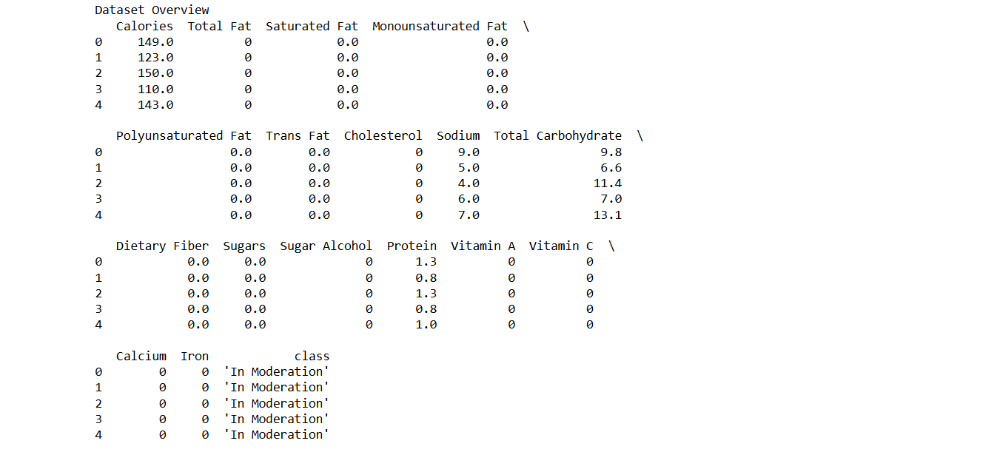
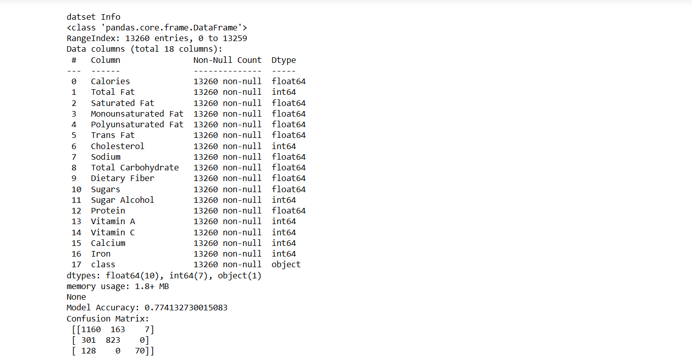
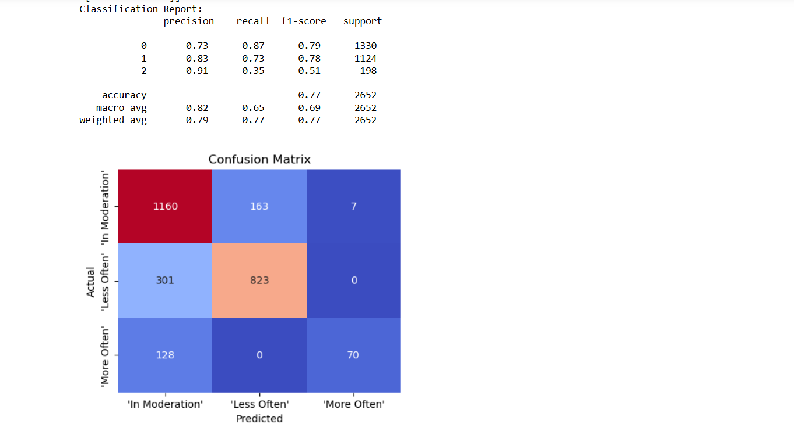

# BLENDED LEARNING
# Implementation of Support Vector Machine for Classifying Food Choices for Diabetic Patients

## AIM:
To implement a Support Vector Machine (SVM) model to classify food items and optimize hyperparameters for better accuracy.

## Equipments Required:
1. Hardware – PCs
2. Anaconda – Python 3.7 Installation / Jupyter notebook

## Algorithm
1.Import the required Python libraries such as pandas, sklearn, seaborn and matplotlib.

2.Load the dataset using pandas read_csv() function.

3.Separate the dataset into input features (X) and target variable (y).

4.Apply data preprocessing such as scaling using MinMaxScaler and label encoding using LabelEncoder.

5.Split the dataset into training and testing data using train_test_split().

6.Create the classification model using LogisticRegression / SVM classifier.

7.Train the model using the fit() function with training data.

8.Predict the output for the testing dataset using predict().

9.Evaluate the model using accuracy score, confusion matrix and classification report.

10.Visualize the confusion matrix using seaborn heatmap.

## Program:
```
/*
Program to implement SVM for food classification for diabetic patients.
Developed by: Johan Renish A
RegisterNumber:212225040159
*/

import pandas as pd
from sklearn.model_selection import train_test_split
from sklearn.linear_model import LogisticRegression
from sklearn.preprocessing import LabelEncoder,MinMaxScaler
from sklearn.svm import SVC
from sklearn.preprocessing import StandardScaler
from sklearn.metrics import accuracy_score,precision_score,recall_score,f1_score,confusion_matrix,classification_report
import seaborn as sns
import matplotlib.pyplot as plt
df=pd.read_csv("food_items (1).csv")
#inspect the dataset
print("Dataset Overview")
print(df.head())
print("\ndatset Info")
print(df.info())
X_raw=df.iloc[:, :-1]
y_raw=df.iloc[:, -1:]
X_raw
scaler=MinMaxScaler()
X=scaler.fit_transform(X_raw)
label_encoder=LabelEncoder()
y=label_encoder.fit_transform(y_raw.values.ravel())
X_train,X_test,y_train,y_test=train_test_split(X,y,test_size=0.2,stratify=y,random_state=123)
penalty='l2'
multi_class='multnomial'
solver='lbfgs'
max_iter=1000
model = LogisticRegression(max_iter=2000)
model.fit(X_train, y_train)
y_pred = model.predict(X_test)
accuracy = accuracy_score(y_test, y_pred)
conf_matrix = confusion_matrix(y_test, y_pred)
class_report = classification_report(y_test, y_pred)
print("Model Accuracy:", accuracy)
print("Confusion Matrix:\n", conf_matrix)
print("Classification Report:\n", class_report)
plt.figure(figsize=(5, 4))
sns.heatmap(conf_matrix, annot=True, fmt='d', cmap='coolwarm', cbar=False, 
            xticklabels=label_encoder.classes_, yticklabels=label_encoder.classes_)
plt.title("Confusion Matrix")
plt.xlabel("Predicted")
plt.ylabel("Actual")
plt.show()
```

## Output:



## Result:
Thus, the SVM model was successfully implemented to classify food items for diabetic patients, with hyperparameter tuning optimizing the model's performance.
