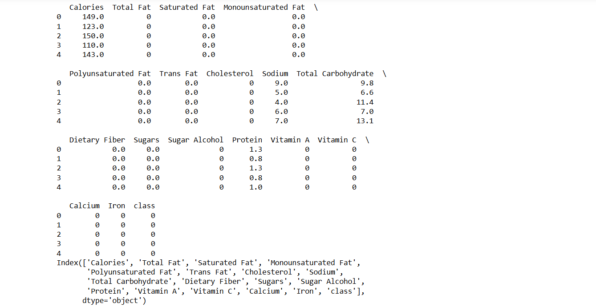
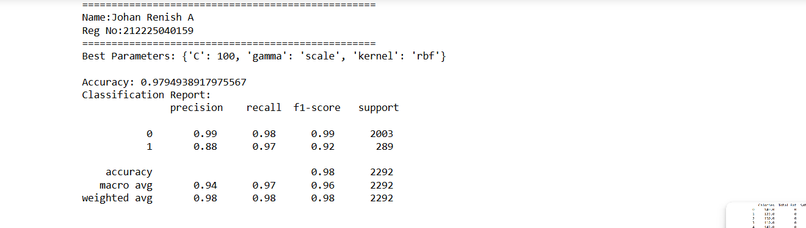
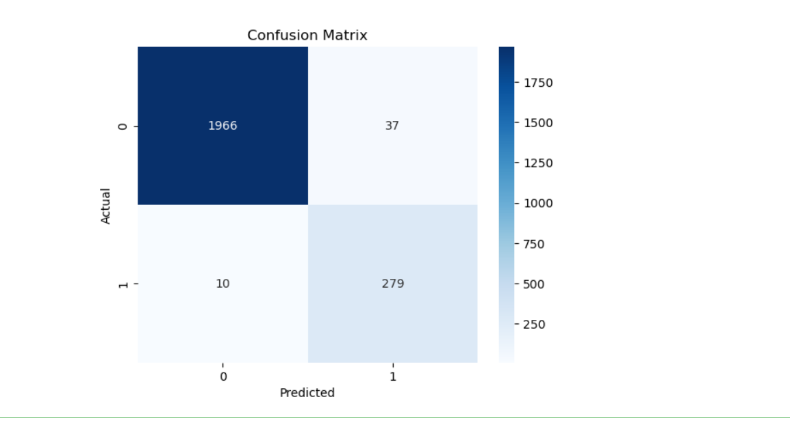

# BLENDED LEARNING
# Implementation of Support Vector Machine for Classifying Food Choices for Diabetic Patients

## AIM:
To implement a Support Vector Machine (SVM) model to classify food items and optimize hyperparameters for better accuracy.

## Equipments Required:
1. Hardware – PCs
2. Anaconda – Python 3.7 Installation / Jupyter notebook

## Algorithm
1.Import necessary libraries such as pandas, sklearn, matplotlib, and seaborn.
2.Load the dataset using pandas and display basic information.
3.Select relevant features (Calories, Fat, Sugars, etc.) and the target variable.
4.Split the dataset into training and testing sets using train_test_split().
5.Apply feature scaling using StandardScaler to normalize the data.
6.Initialize the Support Vector Machine model using SVC().
7.Define a parameter grid for hyperparameter tuning (C, kernel, gamma).
8.Use GridSearchCV to find the best model parameters.
9.Train the SVM model and make predictions on test data.
10.Evaluate the model using accuracy score, classification report, and confusion matrix.
## Program:
```
/*
Program to implement SVM for food classification for diabetic patients.
Developed by: Johan Renish A
RegisterNumber:212225040159
*/
import pandas as pd
import matplotlib.pyplot as plt
from sklearn.model_selection import train_test_split, GridSearchCV
from sklearn.preprocessing import StandardScaler
from sklearn.svm import SVC
from sklearn.metrics import accuracy_score, classification_report, confusion_matrix
import seaborn as sns
# Step 1: Load the dataset from the URL
data = pd.read_csv('food_items_binary.csv')
# Step 2: Data Exploration
print(data.head())
print(data.columns)
# Step 3: Selecting Features and Target
features = ['Calories', 'Total Fat', 'Saturated Fat', 'Sugars', 'Dietary Fiber', 'Protein']
target = 'class'
X = data[features]
y = data[target]
# Step 4: Splitting Data
X_train, X_test, y_train, y_test = train_test_split(X, y, test_size=0.3, random_state=42)
# Step 5:Feature Scaling
scaler=StandardScaler()
X_train = scaler.fit_transform(X_train)
X_test = scaler.transform(X_test)
# Step 6: Model Training with Hyperparameter Tuning using GridSearchCV
svm = SVC()
param_grid = {
    'C': [0.1, 1, 10, 100],              
    'kernel': ['linear', 'rbf'],         
    'gamma': ['scale', 'auto']           
}
    
grid_search = GridSearchCV(svm, param_grid, cv=5, scoring='accuracy')
grid_search.fit(X_train, y_train)
best_model = grid_search.best_estimator_
print("="*50)
print("Name:Johan Renish A")
print("Reg No:212225040159")
print("="*50)
print("Best Parameters:", grid_search.best_params_)
# Step 7: Model Evaluation
y_pred = best_model.predict(X_test)
accuracy = accuracy_score(y_test, y_pred)
print("Accuracy:", accuracy)
print("Classification Report:\n", classification_report(y_test, y_pred))
conf_matrix = confusion_matrix(y_test, y_pred)
sns.heatmap(conf_matrix, annot=True, fmt="d", cmap="Blues")
plt.xlabel("Predicted")
plt.ylabel("Actual")
plt.title("Confusion Matrix")
plt.show()
```
## Output:



## Result:
Thus, the SVM model was successfully implemented to classify food items for diabetic patients, with hyperparameter tuning optimizing the model's performance.
